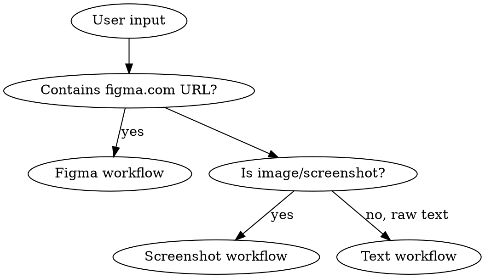
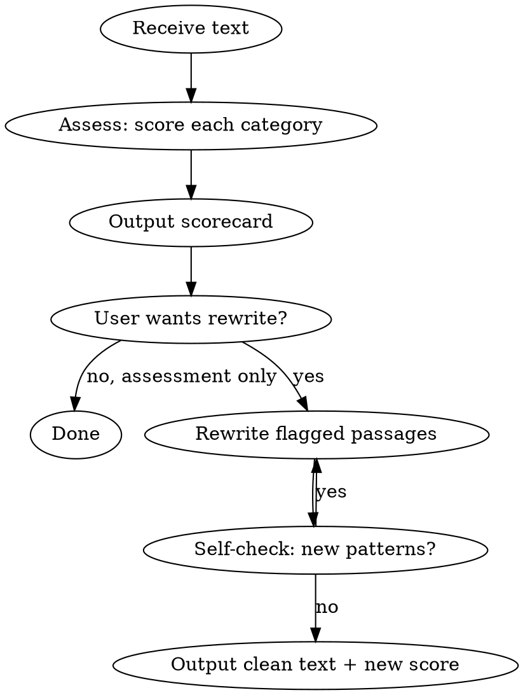

# Humanize Text

## Overview

Assess and rewrite text to eliminate AI authorship signals. Based on Wikipedia's "Signs of AI Writing" field guide, adapted for UX copywriting, product copy, and marketing text.

Works with three input types: raw text, Figma URLs, and UI screenshots.

**Core principle:** AI text regresses to statistical mean -- it replaces specific, human details with generic, positive-sounding filler. Good UX copy is the opposite: specific, concise, and written for a real person doing a real thing.

## When to Use

- User provides text and asks to assess, score, or humanize it
- User shares a Figma URL and wants UX copy reviewed or improved
- User shares a UI screenshot and wants copy assessed
- User wants to reduce AI writing signals in product copy, landing pages, onboarding flows, tooltips, CTAs, error messages, or marketing text
- You are drafting UX copy and want to self-check before delivering

## Input Detection



Detect the input type and follow the matching workflow:

- **Figma URL** (contains `figma.com/design/`) -> Figma workflow
- **Image file or screenshot** (user shares .png/.jpg or pastes screenshot) -> Screenshot workflow
- **Raw text** (anything else) -> Text workflow (standard)

---

## Figma Workflow

When the user provides a Figma URL:

### Step 1 -- Extract design context and screenshot

Use `get_design_context` with the fileKey and nodeId parsed from the URL. Also use `get_screenshot` for visual reference. Parse the URL:
- `figma.com/design/:fileKey/:fileName?node-id=:nodeId` -- convert `-` to `:` in nodeId
- `figma.com/design/:fileKey/branch/:branchKey/:fileName` -- use branchKey as fileKey

### Step 2 -- Extract all text content

From the design context response, identify every text node and its content. Group text by UI role:

| Group | Examples |
|-------|---------|
| Headlines/titles | Hero text, section headers, card titles |
| Body copy | Descriptions, feature explanations, paragraphs |
| Microcopy | Buttons, labels, tooltips, placeholders, error states, empty states |
| Navigation | Menu items, breadcrumbs, tab labels |

### Step 3 -- Assess and score

Run the full 7-category assessment on all extracted text. Score each text group separately AND give a total score.

Output format:
```
## Figma Copy Assessment: [frame name]

### Headlines & Titles
| Text | Score | Issues |
|------|-------|--------|
| "Unlock your potential" | 3/10 | AI vocab (unlock), vague benefit |

### Body Copy
[same table]

### Microcopy
[same table]

### Overall Scorecard
[standard 7-category scorecard]
```

### Step 4 -- Rewrite and push back to Figma

For each flagged text node, provide the improved copy in a before/after table. Then ask: **"Push these changes to Figma?"**

If yes:

1. **Load the `figma-use` skill FIRST** (mandatory before any `use_figma` call)
2. Use `get_design_context` to map text content to node IDs
3. For each text change, use `use_figma` with JavaScript that finds the node, loads its font, and updates the characters
4. Batch multiple changes into minimal `use_figma` calls

Example JavaScript for `use_figma` -- single node:
```javascript
const node = figma.getNodeById("NODE_ID");
if (node && node.type === "TEXT") {
  await figma.loadFontAsync(node.fontName);
  node.characters = "New copy here";
}
```

Multiple nodes in one call:
```javascript
const changes = [
  { id: "123:456", text: "New headline" },
  { id: "123:789", text: "New body text" },
];
for (const change of changes) {
  const node = figma.getNodeById(change.id);
  if (node && node.type === "TEXT") {
    await figma.loadFontAsync(node.fontName);
    node.characters = change.text;
  }
}
```

**Mixed styles:** If a text node has multiple fonts/sizes/colors, check `node.getStyledTextSegments(["fontName", "fontSize"])` first. Use range methods (`node.setRangeFontName()`, etc.) to preserve styling when updating.

---

## Screenshot Workflow

When the user provides a UI screenshot:

### Step 1 -- Read the image

Use the Read tool on the image file. As a multimodal model, you can see the UI and all visible text.

### Step 2 -- Extract all visible text

List every piece of text visible in the screenshot, grouped by UI role (headlines, body, microcopy, navigation). Note the approximate location of each element.

### Step 3 -- Assess and score

Run the full 7-category assessment. With screenshots you can also assess text in visual context:
- Is the copy length appropriate for the UI element's size?
- Does the microcopy match the interaction pattern?
- Are labels clear enough without surrounding context?

### Step 4 -- Provide before/after table

```
| Element | Location | Current | Suggested | Issue |
|---------|----------|---------|-----------|-------|
| Hero headline | top center | "Unlock Your Potential" | "Get more done, together" | AI vocab, title case |
| CTA button | below hero | "Get Started Today" | "Try it free" | generic CTA |
| Feature desc | left card | "Seamlessly integrate..." | "Connects to Slack, GitHub..." | AI vocab, vague |
```

If the user also has the Figma source, suggest they share the URL so you can push changes directly.

---

## Text Workflow (Standard)



1. **Assess** -- scan the input against all 7 categories, score each 1-10
2. **Scorecard** -- output the category scores, total score, and flagged instances
3. **Rewrite** -- fix flagged passages (always do this unless user only asked for assessment)
4. **Self-check** -- re-scan rewritten text, confirm no new patterns
5. **Output** -- clean text + updated scorecard showing improvement

---

## Scoring System

Rate each category **1-10** where:
- **10** = no AI signals detected, reads fully human
- **7-9** = minor issues, 1-2 isolated instances
- **4-6** = noticeable pattern, multiple instances
- **1-3** = heavy AI signals, pervasive pattern

### Scorecard Format

Always output the assessment in this format:

```
## AI Writing Assessment

| Category                  | Score | Flags |
|---------------------------|-------|-------|
| 1. AI Vocabulary          | X/10  | [count] instances |
| 2. Content Inflation      | X/10  | [count] instances |
| 3. Grammar Patterns       | X/10  | [count] instances |
| 4. UX Copy Quality        | X/10  | [count] issues |
| 5. Structural Tells       | X/10  | [count] issues |
| 6. Punctuation/Formatting | X/10  | [count] issues |
| 7. Meta-Content           | X/10  | [count] instances |
| **Total**                 | **XX/70** | |
| **Human Score**           | **XX%** | (total / 70 x 100) |

### Flagged instances
[list each flag: category, exact phrase, why it's a problem]
```

A **Human Score** above 85% is the target. Below 60% means heavy rewriting needed.

---

## Pattern Categories

### 1. AI Vocabulary (strongest single signal)

AI models overuse specific words. One or two may be coincidence; clusters are the tell.

**Flagged words (across all models):** Additionally (sentence-opener), align with, boasts (meaning "has"), bolstered, crucial, cultivating, commitment to, contributing to, delve, diverse array, emphasizing, encompassing, enduring, enhance, ensuring, exemplifies, featuring, fostering, garner, groundbreaking, highlight (verb), in the heart of, intricate/intricacies, interplay, key (adj.), landscape (abstract), meticulous/meticulously, natural beauty, nestled, pivotal, profound, reflecting, renowned, rich (filler adj.), showcase/showcasing, symbolizing, tapestry (abstract), testament, underscore (verb), valuable, vibrant

**UX copy additions to watch:** seamless/seamlessly, empower, unlock, elevate, streamline, leverage, robust, cutting-edge, innovative, transformative, revolutionize, game-changing, next-level, state-of-the-art, best-in-class, world-class, holistic

**Fix -- swap table:**

| AI word | UX-friendly alternatives |
|---------|------------------------|
| seamless | smooth, easy, quick, painless |
| empower | let, help, give you |
| unlock | get, open, start using |
| elevate | improve, raise, make better |
| leverage | use, build on, take advantage of |
| robust | strong, reliable, solid |
| streamline | simplify, speed up, cut steps from |
| delve/delve into | look at, dig into, check |
| pivotal | important, big, key |
| tapestry/landscape (abstract) | mix, range, world, space |
| vibrant | lively, active, busy |
| underscore (verb) | show, prove, make clear |
| meticulous | careful, precise, thorough |
| testament | proof, sign, evidence |
| garner | get, earn, win |
| fostering | building, growing, encouraging |
| showcase | show, highlight, feature |
| Additionally (sentence start) | Also, Plus, And -- or just merge sentences |

**Rule:** Don't swap one AI word for another. If the sentence is filler, delete it.

---

### 2. Content Inflation

AI inflates importance, invents significance, adds hollow analysis. In UX copy, this manifests as feature puffery and benefit stacking with no specifics.

#### 2a. Significance/legacy inflation
**Signals:** "stands/serves as", "is a testament", "a vital/crucial/pivotal role", "reflects broader", "setting the stage", "represents a shift", "key turning point", "indelible mark"

**UX version:** "revolutionizing the way you...", "transforming how teams...", "redefining the standard for..."

**Fix:** State what it does, for whom, concretely:
- Bad: "Revolutionizing the way teams collaborate across distributed environments"
- Good: "Share files with your team without leaving the chat"

#### 2b. Superficial analysis ("-ing" phrases)
**Signals:** Sentences trailing off with "highlighting...", "ensuring...", "reflecting...", "enabling teams to..."

**Fix:** Delete the trailing phrase, or turn it into a concrete benefit:
- Bad: "Real-time sync keeps your data current, ensuring teams stay aligned and productive"
- Good: "Real-time sync. Everyone sees the same data."

#### 2c. Promotional/ad language
**Signals:** "boasts a", "rich", "profound", "nestled", "groundbreaking", "diverse array", "commitment to excellence"

**UX version:** "best-in-class", "industry-leading", "world-class", "unparalleled", "next-generation"

**Fix:** Replace with a specific, provable claim:
- Bad: "Industry-leading performance with unparalleled reliability"
- Good: "99.9% uptime. Pages load in under 200ms."

#### 2d. Vague attributions
**Signals:** "Experts argue", "Industry reports suggest", "Studies show"

**Fix:** Name the source or delete. "Trusted by 2,400 teams" beats "Trusted by thousands of industry professionals worldwide."

#### 2e. Challenges-and-future formula
**Signals:** "Despite... faces challenges...", "Despite these challenges..."

**Fix:** In UX copy, this pattern usually appears in case studies and about pages. State the problem plainly, then state what was done. No optimistic bookend.

---

### 3. Grammar Patterns

#### 3a. Copulative avoidance ("is/are" -> "serves as/stands as")
AI avoids simple verbs: "serves as", "stands as", "represents", "features" (for "has"), "offers" (for "has").

**Fix:** Use "is", "has", "does":
- "Our platform serves as your single source of truth" -> "Your single source of truth"
- "The dashboard features real-time analytics" -> "The dashboard has real-time analytics" or just "Real-time analytics, built in"

#### 3b. Negative parallelisms
**Signals:** "Not only... but also...", "It's not just..., it's...", "More than just a..."

**UX version:** "More than just a CRM -- it's your growth engine"

**Fix:** Pick the stronger claim. Say it once:
- Bad: "Not just a task manager, but a complete productivity ecosystem"
- Good: "Manage tasks, track time, and hit deadlines. One app."

#### 3c. Rule of three
AI defaults to "X, Y, and Z" to sound comprehensive.

**Fix:** If all three matter, keep them. If it's filler triads like "efficiency, productivity, and growth" -- cut to what's real.

#### 3d. Elegant variation (synonym cycling)
AI avoids repeating words by cycling: "the tool", "the platform", "the solution", "the product."

**Fix:** Pick one name and stick with it. Use "it" for pronouns. Repetition is fine.

---

### 4. UX Copy Quality

This category scores how well the text follows UX writing best practices. AI copy fails these even when it avoids the vocabulary tells.

#### 4a. Clarity over cleverness
**Problem:** AI loves compound benefit statements that try to say everything at once.
- Bad: "Empower your team to collaborate seamlessly across projects with intuitive tools designed for modern workflows"
- Good: "Work on projects together. No setup needed."

**Score low when:** Sentences need re-reading to understand. The reader can't tell what to DO.

#### 4b. Specificity over abstraction
**Problem:** AI uses abstract nouns ("productivity", "efficiency", "growth") instead of concrete outcomes.
- Bad: "Drive measurable growth across your organization"
- Good: "Teams using this ship 2x faster in the first month"

**Score low when:** Claims can't be verified or visualized. Swap "measurable growth" for an actual measure.

#### 4c. User-first framing
**Problem:** AI writes about the product. UX copy writes about the user.
- Bad: "Our platform provides advanced analytics capabilities"
- Good: "See which pages your visitors actually read"

**Score low when:** Subject of sentences is the product/company, not "you" or the user's action.

#### 4d. Appropriate length
**Problem:** AI over-explains. UX copy matches length to context.
- Button: 1-4 words ("Save draft", "Get started")
- Tooltip: 1 sentence, max 15 words
- Error message: what happened + what to do next
- Landing hero: 6-12 words headline, 15-25 words subhead
- Feature description: 1-2 sentences

**Score low when:** Text is 2x longer than it needs to be for its context.

#### 4e. Natural voice and rhythm
**Problem:** AI produces uniform, mid-length sentences with no personality. Real UX copy has rhythm -- short punchy lines mixed with longer ones. It can be blunt. Incomplete sentences are fine.
- Bad: "Our solution provides you with the tools you need to manage your projects effectively and efficiently."
- Good: "Manage projects. Track progress. Ship on time."

**Score low when:** Every sentence is the same length. No fragments. No personality.

---

### 5. Structural Tells

#### 5a. Title case in headings
AI capitalizes All Main Words. UX copy uses sentence case.
**Fix:** "How it works" not "How It Works"

#### 5b. Overuse of boldface
AI bolds terms mechanically.
**Fix:** Remove most bold. In UX, bold only the one thing you want the eye to hit first.

#### 5c. Inline-header vertical lists
AI: **Feature Name:** Description of feature that does a thing.
**Fix:** Use simpler list formatting, or convert to short paragraphs.

#### 5d. Unnecessary tables
**Fix:** If fewer than 4 rows, write it as a sentence.

---

### 6. Punctuation & Formatting

#### 6a. Em dash rules
**Personal messages, emails, outreach, LinkedIn posts:** NEVER use em dashes. Zero. Replace with commas, parentheses, colons, or separate sentences. Em dashes in personal writing are one of the strongest AI tells.
- Bad: "I saw your product -- looks like you're scaling fast"
- Good: "I saw your product. Looks like you're scaling fast."

**UI text (feature descriptions, landing pages, tooltips):** Allowed only when the alternative is noticeably clunky, and max 1 per block of text. If a comma or period works, use that instead.
- OK: "Real-time sync, both ways" (comma works, no dash needed)
- OK if unavoidable: "Design with your real components -- Button, Modal, the same ones in your codebase" (listing after a dash reads better than alternatives here)

#### 6b. Curly quotation marks
ChatGPT uses curly quotes. Inconsistent mixing is a signal. Normalize.

#### 6c. Markdown artifacts
Leftover `**bold**`, `# headings` from chatbot output. Strip for target format.

---

### 7. Meta-Content (delete entirely)

Dead giveaways -- remove completely:

- **Disclaimers:** "It's important to note...", "Worth noting...", "It's crucial to remember..."
- **Summaries:** "In summary...", "In conclusion...", "Overall..."
- **Chatbot language:** "I hope this helps", "Would you like...", "Here is a...", "Let me know if..."
- **AI pleasantries (ban in rewrites too):** "Hope you're doing well", "Hope this finds you well", "Happy to help", "Happy to set that up", "Happy to chat", "Feel free to reach out", "Don't hesitate to", "I'd love to", "Excited to share", "Thrilled to announce", "Glad to hear". These sound polite but are AI tells. Use direct language instead: "Want to try it?" not "Happy to set that up if you'd like!"
- **Cutoff language:** "As of my last update...", "Based on available information..."
- **Prompt refusals:** "As an AI language model..."
- **Placeholders:** `[insert X]`, `XX-XX` dates, `URL`

---

## Self-Check After Rewriting

- [ ] No new AI vocabulary introduced while fixing old ones?
- [ ] Every sentence adds concrete value? (Delete anything that could apply to any product.)
- [ ] Sentence length varies naturally? (Mix short and long.)
- [ ] Using "is" and "are" naturally?
- [ ] Zero em dashes in personal messages/emails/outreach? (for UI text: max 1 per block, only if unavoidable)
- [ ] No AI pleasantries? ("happy to", "hope you're doing well", "feel free to", "excited to", "don't hesitate")
- [ ] Headings in sentence case?
- [ ] User is the subject of sentences, not the product?
- [ ] Copy length matches its context (button, headline, feature block, etc.)?

## Quick Reference: Fixes by Impact

| # | Pattern | Fix |
|---|---------|-----|
| 1 | AI vocabulary clusters | Simpler words or delete filler entirely |
| 2 | Significance inflation | State the fact. Delete the inflation. |
| 3 | Vague benefit stacking | One specific, provable claim |
| 4 | Product-first framing | Rewrite with "you" as subject |
| 5 | Over-length for context | Cut to match: button, tooltip, hero, etc. |
| 6 | Superficial "-ing" phrases | Delete or convert to concrete benefit |
| 7 | Copulative avoidance | Use "is", "has", "does" |
| 8 | Em dashes | Remove all. Use commas, colons, periods. |
| 9 | Negative parallelisms | Pick one claim, state it directly |
| 10 | Meta-content/disclaimers | Delete entirely |

## Common Mistakes

**Over-correcting:** One "crucial" is fine. Clusters are the problem. Preserve genuine voice.

**Losing meaning:** Extract the real fact from inflated passages. Don't delete everything.

**Making it flat:** The goal isn't dumbed-down text. It's text a real person would write -- specific, varied, occasionally imperfect, with personality.

**Swapping AI words for AI words:** "Explores the rich landscape" is no better than "delves into the intricate tapestry." Write "looks at the range of" or whatever is actually precise.

**Ignoring context:** A 404 page, a hero headline, a tooltip, and a case study all need different lengths and tones. Score and rewrite relative to the text's purpose.
